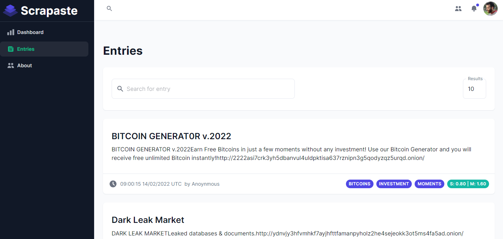
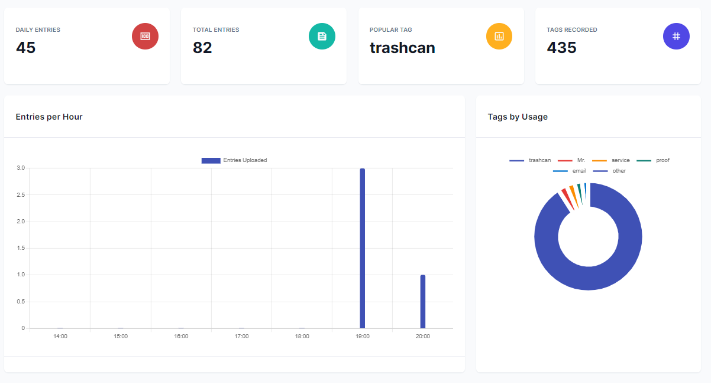
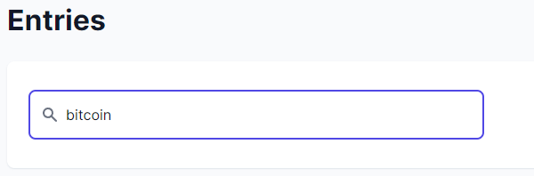
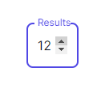

<!-- PROJECT LOGO -->
 

    

  

    the official client-side repo of Scrapaste
     
    <a href="https://scrapaste.herokuapp.com/">Visit App</a>  
    ·
    <a href="https://github.com/strauss02/scraper-frontend/issues">Report Bug</a>
    ·
    <a href="https://github.com/strauss02/scraper-frontend/issues">Request Feature</a>
  

## About The Project

Scrapaste is a scraping service that extracts information off darknet pastebins.  
In addition to the basic scraping, it also analyses each entry scraped.  
The metrics added to each entry currently include Sentiment analysis and Entity analysis.  
There also some nice general statistics presented.

This project was originally created as a class project for my programming course

(<a href="#top">back to top</a>)

### Built With

 

- React.js
- Express
- Next.js
- Redux Toolkit
- MongoDB
- MUI

<!-- GETTING STARTED -->

## Getting Started

Go ahead and click the [link](https://scrapaste.herokuapp.com/) to access the website.

### Prerequisites

A modern browser.

After entering the website, you would be presented with a handful of general statistics regarding the collected entries.  
 

### The entries section

 
Once entering the entries section, you can view all of the entries scraped up until now. The database self-updates every 2 minutes, and will add any new scrapes - so you don't have to worry about refreshing.  
   
 

Specific entries can be searched by using the omni-search bar.  
any relevant entry will show up in the search results.

The amount of search results to display can be controlled by using the results selector.

Every entry card includes information about that entry. We can see:

- The entry title
- The entrie's text content
- Entry posting date
- Entry tags
- Entry sentiment score

The tags are actually the results of an entity analysis which detects the relevant entities in the entry.

The sentiment analysis pill includes two pieces of information:

- The sentiment score - denoted by S (whether the text conveys negative or positive emotion)
- The sentiment magnitude - denoted by M (how decisive and prevalent is the sentiment conveyed by the text)

<!-- USAGE EXAMPLES -->

(<a href="#top">back to top</a>)

